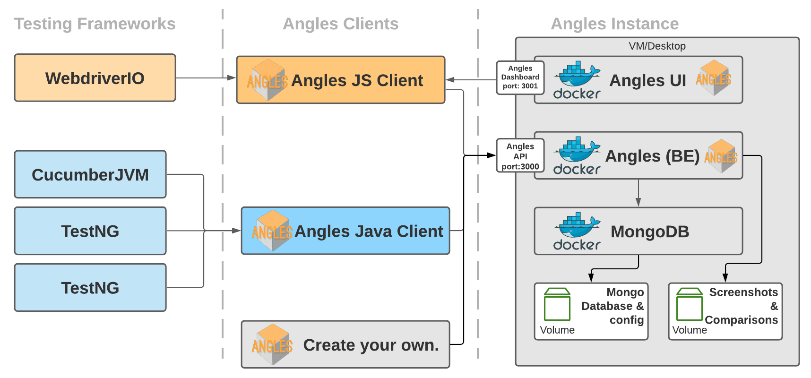

Angles is a centralised test automation dashboard where you can store your automated test results and screenshots using a clearly defined [API](https://editor.swagger.io/?url=https://raw.githubusercontent.com/AnglesHQ/angles/master/swagger/swagger.json). By using this API, you are no longer limited to a single framework or programming language and can use the same dashboard for all your test automation frameworks. If you would like a quick introduction on Angles and to see how easy it is to set up, just watch the video below.

<iframe width="100%" height="315" src="https://www.youtube.com/embed/auIqV8pgvi4" frameborder="0" allow="autoplay; encrypted-media" allowfullscreen></iframe>
**YouTube**: *Introduction to and setup of Angles Test Automation Dashboard*

Some features already provided by Angles are:
- Visual comparison (against a configurable baseline)
- Setting ignore boxes for the visual comparisons (areas to exclude in the compare)
- Finding an image within a screenshot (multi-scale template matching, e.g. to check a logo or button is displayed)
- Storing additional details as part of the test runs such as: 
    - team that ran the test
    - environment it was run on
    - artefact versions for system under test.
    - platform details (e.g., what platform the test has been executed against)
- Automatic cleanup of builds and screenshots after 90 days (configurable) 
- Test Case history (look at a single test case over time)
- Test Matrix (multiple test run comparison)
- User management with roles (admin, team lead and user), personal API tokens and optional Okta (SSO) login
- Batch mode in the clients, to store all test executions for a build in a single request
- Client libraries for [JavaScript](https://github.com/AnglesHQ/angles-javascript-client), [Java](https://github.com/AnglesHQ/angles-java-client) and [Python](https://github.com/AnglesHQ/angles-python-client)

Feel free to watch the video below where I go over the features in Angles.

<iframe width="100%" height="315" src="https://www.youtube.com/embed/ypE4SknhTh8" frameborder="0" allow="autoplay; encrypted-media" allowfullscreen></iframe>
**YouTube**: *Features of the Angles Test Automation Dashboard*

## Overview
The Angles dashboard consists of 3 containers:
- a front-end ([angles-ui](https://hub.docker.com/u/angleshq/angles-ui))
- a back-end ([angles](https://hub.docker.com/u/angleshq/angles))
- a Mongo container (to store the results)



**Image** : Angles architecture (as it currently stands)


### The back-end
The back-end for Angles provides an API to create, retrieve, update and remove your automation test data. 
It has been [configured](https://github.com/AnglesHQ/angles/blob/master/config/database.config.js) to use a local instance of mongo which is set up using docker-compose. However, you can modify that config file and point it to another mongo instance (as long as it's setup with the right credentials and collections using the [mongo-init.js](https://github.com/AnglesHQ/angles/blob/master/setup/mongo-init.js))

If you want to run the Angles back-end locally with debug logging turned on, just navigate to the Angles folder in the terminal and run the following command.
``` shellscript
# clone the back-end repo, modify the database.config.js file and run:
DEBUG=*:controller node server.js | ./node_modules/.bin/pino-pretty
```
**NOTE:** The code for the angles back-end can be found ([here](https://github.com/AnglesHQ/angles)).

### The front-end (UI)
The Angles front-end uses the Angles API (provided by the back-end) to retrieve and display the stored test data and screenshots. To do this, it makes use of the [angles-javascript-client](https://github.com/AnglesHQ/angles-javascript-client) (the same client used for javascript tests).

To run the Angles front-end locally you can run the following command in the terminal. Make sure you provide the base url of the api (e.g., http://127.0.0.1:3000).
```shellscript
# clone the front-end repo and run:
PORT=3001 ANGLES_API_BASE_URL=<angles_api_base_url> ANGLES_API_BASE_PATH=/rest/api/v1.0 npm start
```
**NOTE:** The code for the angles the frontend can be found ([here](https://github.com/AnglesHQ/angles-ui))

### Setting up Angles (with Docker-Compose)
To set up your own instance of the Angles dashboard you can use the [docker compose](https://github.com/AnglesHQ/angles/blob/master/setup/docker-compose.yml) file and [Docker-compose](https://docs.docker.com/compose/).
You'll need to clone the angles project and then using a terminal navigate to the *"setup"* which contains the docker-compose.yml file, and the mongo-init.js file. The mongo-int.js file will set up the necessary database collections and indexes.

If you're not running Angles locally (e.g., 127.0.0.1), you should also change the environment variable "ANGLES_API_BASE_URL" (for both the backend and front-end containers) in the docker-compose file to point to the url where the angles API is accessible (e.g., domain name or external ip address).

Before starting the containers for the first time, set the "ANGLES_ADMIN_PASSWORD" environment variable — this is the password the initial admin account is seeded with (see [Authentication & User Management](#authentication--user-management) below).

```shellscript
# run in same directory as docker-compose file
docker-compose pull && ANGLES_ADMIN_PASSWORD=<your_admin_password> docker-compose -f docker-compose.yml up -d 
```

#### Tearing down Angles
If you would like to tear down the containers, you can run the following command in the directory with the docker-compose.yml file.

```shellscript
# and to tear it down
docker-compose down
```
**NOTE**: Angles creates volumes to store persistent data (e.g., database config and records), and these will remain even after running the command above. If you wanted to remove this as well you would have to do manually.

### Setting up Angles (with Kubernetes Manifests)

If you would rather run Angles on Kubernetes, the manifests can be found in the [setup/kubernetes](https://github.com/AnglesHQ/angles/tree/master/setup/kubernetes) folder of the angles repo. They are numbered in the order they should be applied (namespace and storage, config, mongo, and finally the angles pods and services):

```shellscript
# run in the setup/kubernetes directory
kubectl apply -f .
```

As with the docker-compose setup, review the config manifest first and set the environment variables (e.g., ANGLES_API_BASE_URL and ANGLES_ADMIN_PASSWORD) to match your environment.

### Authentication & User Management
Angles requires users to sign in. On its first startup the back-end seeds a single administrator account using the following environment variables (set in the docker-compose file or your deployment environment):

- **ANGLES_ADMIN_PASSWORD** – required; the password for the initial admin account. It must meet the password policy (at least 10 characters, with at least one letter, one uppercase letter and one special character), otherwise no admin is seeded.
- **ANGLES_ADMIN_USERNAME** – optional; defaults to `admin`.

**NOTE:** The seeding only happens if the admin user doesn't exist yet. Once created, the password is managed through the app, so changing the environment variable after the first run has no effect.

When running in production (NODE_ENV=production) you must also set a **SESSION_SECRET** environment variable, which is used to sign the session cookies.

#### Roles
Every user has one of three roles:

- **admin** – full access, including user management and authentication settings.
- **team_lead** – elevated access for the teams they belong to.
- **user** – standard access.

Administrators can create and manage users, roles and team membership from the **Admin → User Management** page in the UI.

#### API tokens
Interactive login uses a session cookie, but automated clients (CI pipelines, the [Java](https://github.com/AnglesHQ/angles-java-client), [JavaScript](https://github.com/AnglesHQ/angles-javascript-client) and [Python](https://github.com/AnglesHQ/angles-python-client) clients) authenticate with a personal API token. Generate a token from the **User Settings** page and supply it on each request via the `x-api-key` header.

#### Okta (SSO)
Angles can additionally authenticate users through Okta using OpenID Connect. **Okta is configured entirely from the UI** — go to **Admin → Settings (Authentication Settings)**, enable Okta and provide:

- the Okta **issuer** and **client ID**,
- the **client secret** (write-only: once saved it can be updated but never read back),
- the Okta **groups** to map to the Admin, Team Lead and User roles.

Group membership is resolved on each login and a user is granted the highest-privilege role they match (Admin > Team Lead > User). These settings are stored in the database and take effect without a restart; **none of them are configured through environment variables.** The only Okta-related deployment value is the OIDC redirect URL (`OKTA_CALLBACK_URL`), which depends on where the app is hosted.

### Angles API
Once Angles is running, you can access the documentation by navigating to the following url http://\<angles-server-ip\>:3000/api-docs.

Or if you just want to have a look at the api documentation it can be found in the [swagger.json](https://github.com/AnglesHQ/angles/blob/master/swagger/swagger.json) which you can then load in the [swagger editor](https://editor.swagger.io/?url=https://raw.githubusercontent.com/AnglesHQ/angles/master/swagger/swagger.json).

To use the API to store and retrieve your automated tests results you can use the [Java Client](https://github.com/AnglesHQ/angles-java-client), the [JavaScript Client](https://github.com/AnglesHQ/angles-javascript-client) or the [Python Client](https://github.com/AnglesHQ/angles-python-client).

### Using the API
Before you can store any test results in the Angles dashboard you will need to set up:
- a team (and it's component(s))
- an environment. 

**NOTE:** Your team, component and environment have to exist before you can start adding builds for the relevant team (otherwise angles will return an error when trying to store the results). Creating teams and environments requires an **admin** account.

If you would like to use the [Java examples](https://github.com/AnglesHQ/angles-java-examples) or the [webdriverIO example](https://github.com/AnglesHQ/webdriverio-example), set up the example team, component and environment mentioned below using the angles-api which is accessible via the following url when you set up the containers locally: [http://127.0.0.1:3000/api-docs](http://127.0.0.1:3000/api-docs).

- Set up a team (using the API)

``` json
{
  "name": "angles",
  "components": [
    {
      "name": "example"
    }
  ]
}
```
- Set up an environment (using the API)

``` json
{
  "name": "qa"
}
```

Please refer to the Swagger endpoint once your instance is up and running and click the "Try it out" button on the create team endpoint. Once you fill in the details and click execute, the team will be added. Repeat these steps for the environment.

### Client libraries
There are three client libraries, each providing an AnglesReporter with the same set of features:
- **JavaScript**: [angles-javascript-client](https://github.com/AnglesHQ/angles-javascript-client) (npm) — also used by the Angles front-end itself.
- **Java**: [angles-java-client](https://github.com/AnglesHQ/angles-java-client) (Maven)
- **Python**: [angles-python-client](https://github.com/AnglesHQ/angles-python-client) (pip)

#### Authenticating the clients
As all API requests require authentication, configure the reporter with a personal API token (generated from the **User Settings** page in the UI) before storing any results. Each client exposes a `setApiKey` (`set_api_key` in Python) method, and will then send the token on every request via the `x-api-key` header.

#### Batch mode (single request for all executions)
By default the reporter sends each test execution to the Angles API as soon as `saveTest()` is called. If you enable batch mode with `setBatchMode(true)`, the executions are collected in the reporter instead, and calling `saveAllTests()` at the end of the run stores all of them against the current build in a single request (using the `PUT /build/{buildId}/executions` endpoint). This reduces the number of API calls significantly for large test runs. Screenshots are still uploaded individually as the tests run.

#### Finding an image within a screenshot
Besides comparing screenshots against a baseline, the API can also find a smaller image (the template) within a stored screenshot using multi-scale template matching. This is useful for checks like "is the logo/button visible on this page". The clients expose:
- `findImageInScreenshot(screenshotId, templateScreenshotId, options)` – search for another **stored** screenshot within a screenshot.
- `findUploadedImageInScreenshot(screenshotId, templateFilePath, options)` – upload a **local** template image to search for (the template is not stored).
- `findImageInScreenshotImage(...)` – same search, but returns the screenshot image with the matched region(s) outlined.

The options allow you to tweak the match: `minConfidence` (0-1, default 0.8), `scaleMin`/`scaleMax` (template scale sweep, defaults 0.75-1.25), `maxMatches` (1-25, default 1) and `grayscale` (match on luminance only, which is more tolerant of colour differences between devices). The response contains the matched region(s) with their coordinates, confidence score and the scale at which they were found.

### Angles Cleanup (Cron)
As you can imagine, storing all the test data (and screenshots) without any form of cleanup can mean your instance of Angles can fill up quite quickly.
Therefore, Angles has a nightly cron that will use the build delete API to remove any builds and screenshots **older than 90 days**. If you would like to change this number please BUILD_CLEAN_UP_AGE_IN_DAYS value in the docker-compose file and run the docker-compose command again. 
If you want to keep specific builds,there is a "keep" flag which can be set. With this flag set, those builds will not be removed as part of the nightly run (once they hit the configured age). 

**NOTE** The cleanup will not remove any builds that contain a "baseline" image (to ensure these can still be used for comparison).

